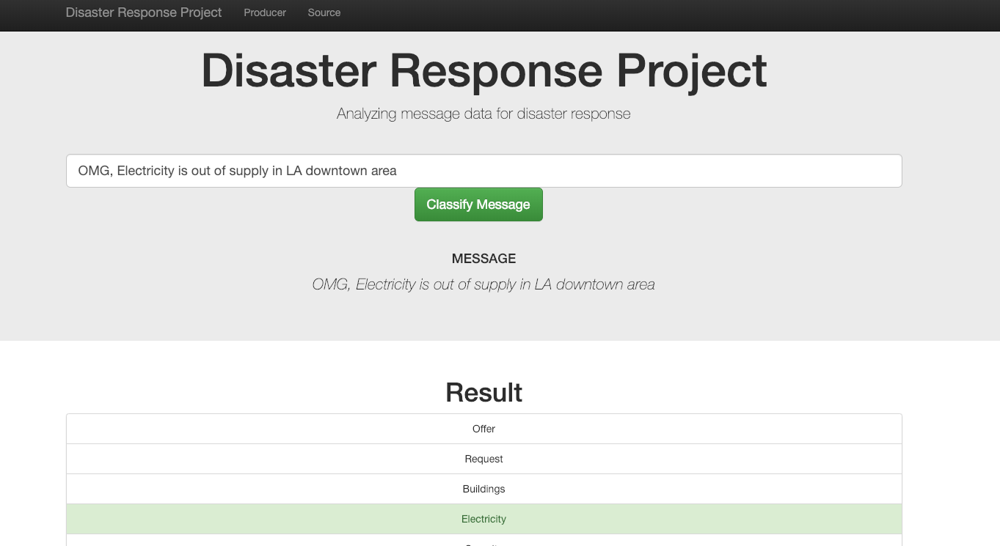

# Disaster Response Pipeline Project
### Objective
This project contructs a NLP data analysis framework for analyzing diasters from twitter messages. Raw data is cleaned and then saved into sql database. Then python sklean, nltk, pandas etc libraries are utilized to extract features for data modeling. Traditional NLP feature extraction methods such as tf/idf are applied and then feed into machine learning models for disaster classification.

### Usage Instructions:
1. Run the following commands in the project's root directory to set up your database and model.

    - To run ETL pipeline that cleans data and stores in database
        `python data/process_data.py data/disaster_messages.csv data/disaster_categories.csv data/DisasterResponse.db`
    - To run ML pipeline that trains classifier and saves
        `python models/train_classifier.py data/DisasterResponse.db models/classifier.pkl`

2. Run the following command in the app's directory to run your web app.
    `python run.py`

3. Go to http://0.0.0.0:3001/ for using the web application.

### Examples:
 

### Tools
1. Web development: Flask, plotly, html
2. Database: sqlite
3. Data processing & modeling: sklearn, nltk etc
